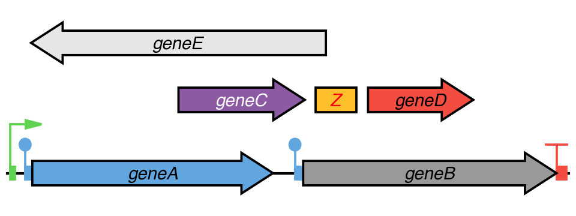
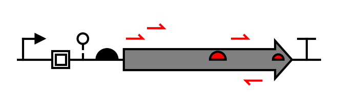
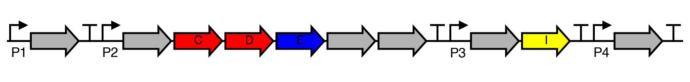
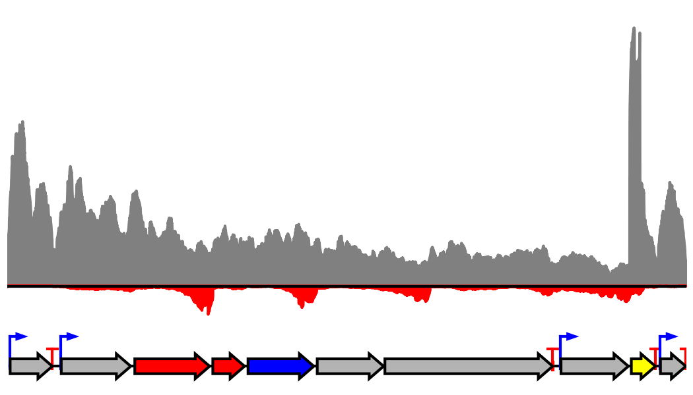

# DNAplotlib

DNAplotlib is a library that enables highly customizable visualization of individual genetic constructs and libraries of design variants. It can be thought of in many ways as matplotlib for genetic diagrams. Publication quality vector-based output is produced and all aspects of the rendering process can be easily customized or replaced by the user. DNAplotlib is capable of SBOL Visual compliant diagrams in addition to a format able to better illustrate the precise location and length of each genetic part. This alternative "traced-based" visualization method enables direct comparison with nucleotide-level information such as RNA-seq read depth or other base resolution measures. While it is envisaged that access will be predominantly via the programming interface, several easy to use text-based input formats can be processed by a command-line scripts to facilitate broader usage. DNAplotlib is cross-platform and open-source software released under the OSI OSL-3.0 license.

If you make use of DNAplotlib in any publications, we kindly ask that the following paper is cited:

<a href="http://pubs.acs.org/doi/abs/10.1021/acssynbio.6b00252">Der B.S., Glassey E., Bartley B.A., Enghuus C., Goodman D.B., Gordon D.B., Voigt C.A., Gorochowski T.E., "DNAplotlib: programmable visualization of genetic designs and associated data", _ACS Synthetic Biology_, 2016. (DOI: 10.1021/acssynbio.6b00252)</a>

## Installation
The DNAplotlib library is contained within the `dnaplotlib.py` file in the `lib` directory and requires Python 3.6+ and matplotlib 3.8+. To install add the location of this file to your `PYTHONPATH` and you are good to: `import dnaplotlib`

## Getting Started
We provide an extensive gallery of use cases for DNAplotlib in the `gallery` directory. Click on a thumbnail below to go directly to the example code:

### Genetic Designs and Annotation
<a href="gallery/all_parts"></a>
<a href="gallery/xnor_truthtable"></a>
<a href="gallery/scatter_annotate"></a>
<a href="gallery/offset_features"></a>
<a href="gallery/annotate_design"></a>
<a href="gallery/input_gff"></a>

### New Part Types and Regulation
<a href="gallery/recombinase_not_gate"></a>
<a href="gallery/recombinase_array"></a>

### Trace-based Rendering
<a href="gallery/multiple_traces"></a>
<a href="gallery/rotated_design"></a>
<a href="gallery/input_bed"></a>

### Dynamics and Evolution
<a href="gallery/repressilator_animate"></a>

### Variant Libraries
<a href="gallery/variants_library"></a>
<a href="gallery/order_orientation_library"></a>

## Build

Create a virtual env:

```shell
python3 -m venv .venv
```

activate the venv:

```shell
source .venv/bin/activate
```

Install dependancies

```shell
pip install -r requirements.txt
```

## Testing

The tests are using [pytest-mpl](https://github.com/matplotlib/pytest-mpl) to check if the gallery examples remain the same (image comparison with some tolerance).
The tests are run with github actions but you can also run it manually:

```shell
pip install -r requirements-test.txt
pytest --mpl
```
