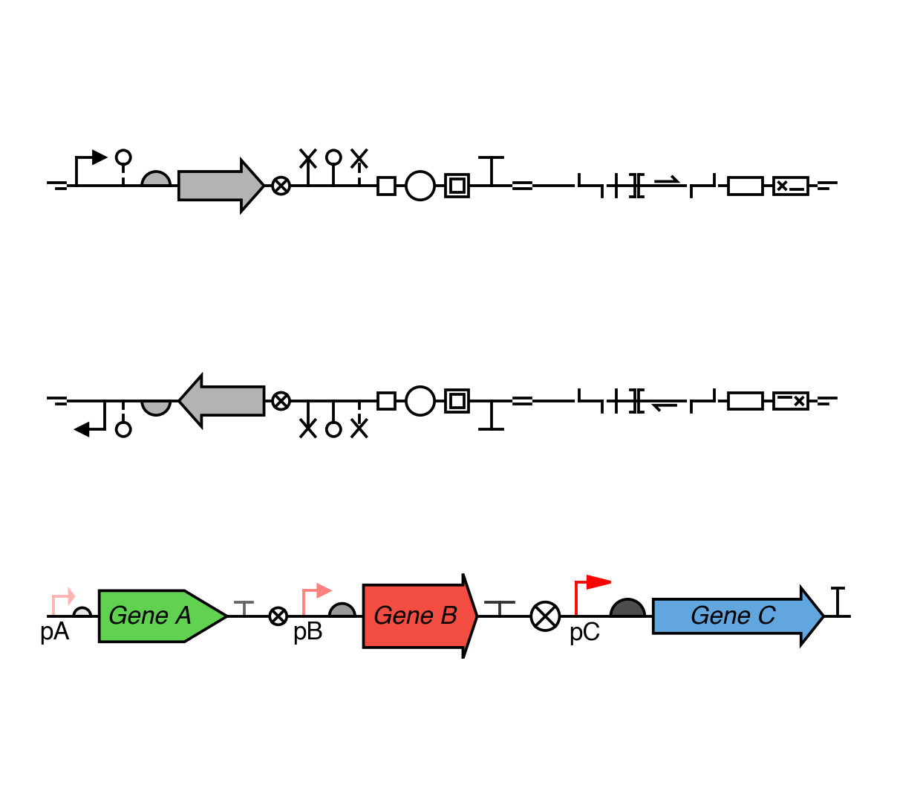
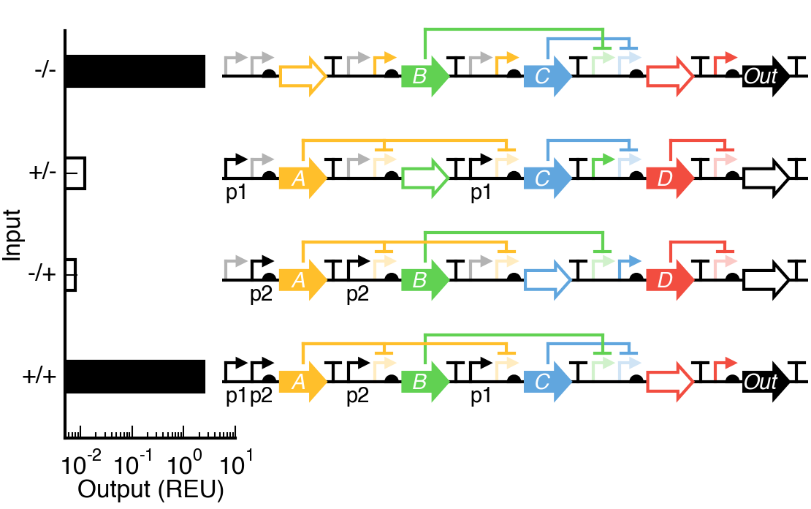
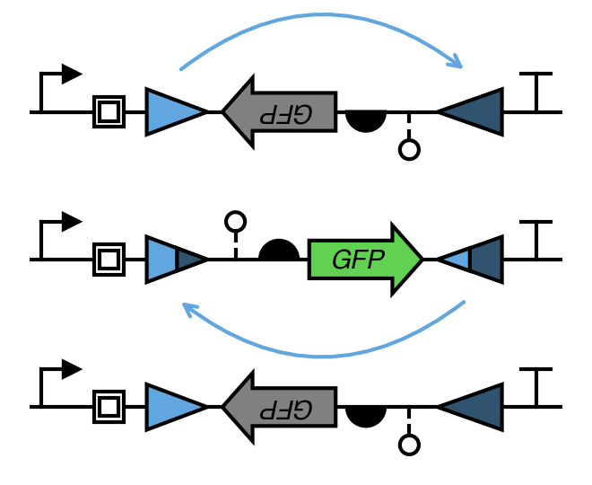
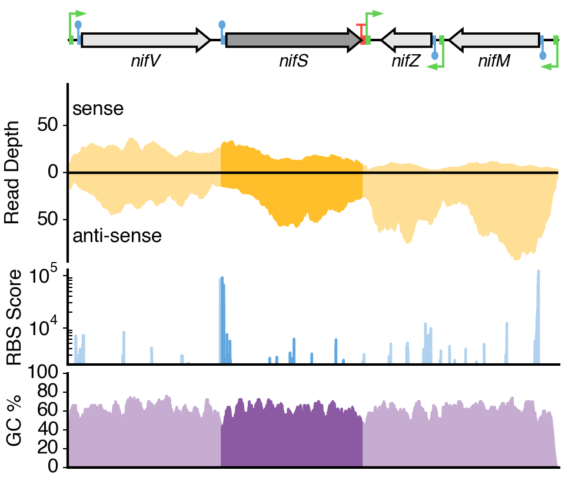
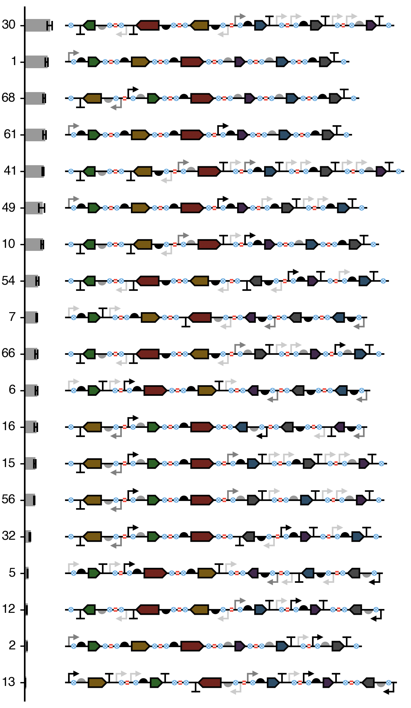
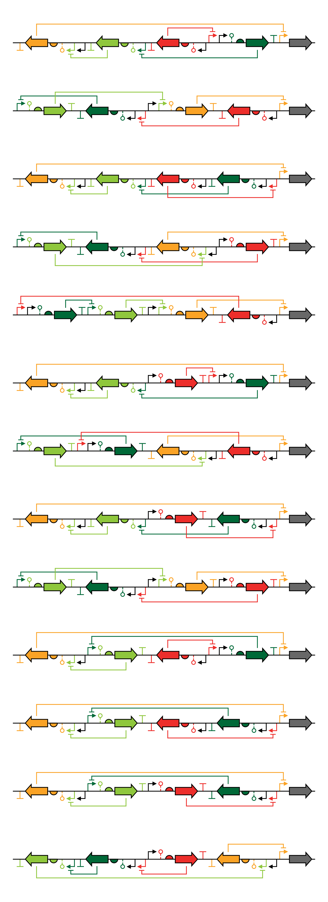

#DNAplotlib

DNAplotlib is a computational toolkit that enables highly customizable visualization of individual genetic constructs and libraries of design variants. Publication quality vector-based output is produced and all aspects of the rendering process can be easily customized or replaced by the user. DNAplotlib is capable of SBOL Visual compliant diagrams in addition to a format able to better illustrate the precise location and length of each genetic part. This alternative visualization method enables direct comparison with nucleotide-level information such as RNA-seq read depth. While it is envisaged that access will be predominantly via the programming interface, several easy to use text-based input formats can be processed by a command-line scripts to facilitate broader usage. An experimental web front-end is also available.

##Installation
The DNAplotlib library is contained within the `dnaplotlib.py` file in the `lib` directory and requires Python 2.6 and matplotlib 1.2 or newer. To install add the location of this file to your `PYTHONPATH` and you are good to: `import dnaplotlib`

DNAplotlib is cross-platform and open-source software developed using Python and released under the OSI Open Software License 3.0 (OSL-3.0) license.

##Getting Started
We provide an extensive gallery of use cases for DNAplotlib in the `gallery` directory. Click on a thumbnail below to go directly to the example:

###Single Designs and Annotation

###New Part Types

###Trace-based Rendering

###Dynamics and Evolution

###Library Visualisation

