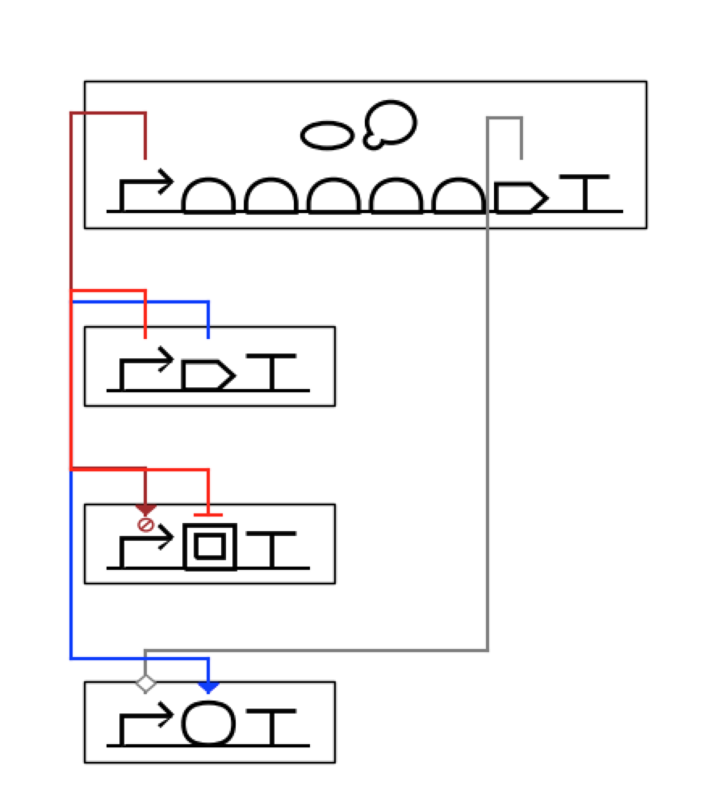
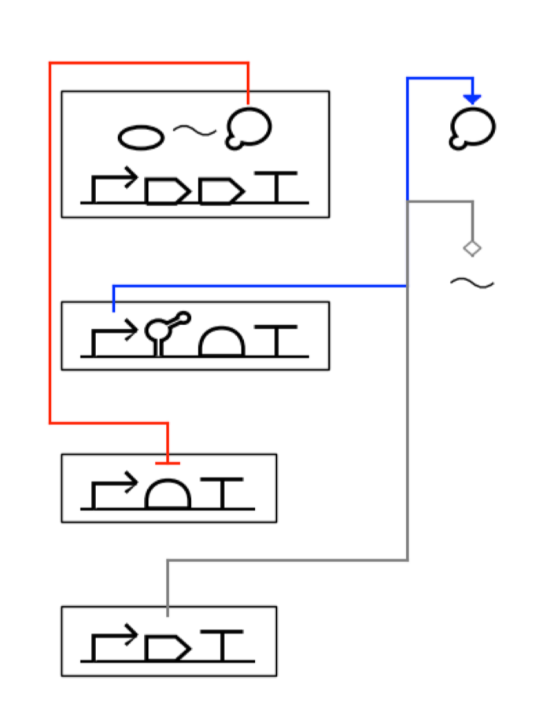
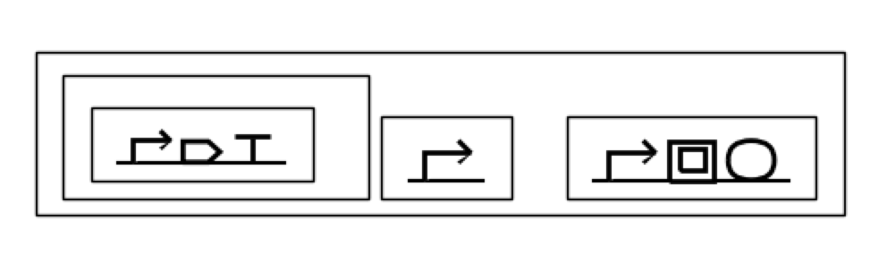
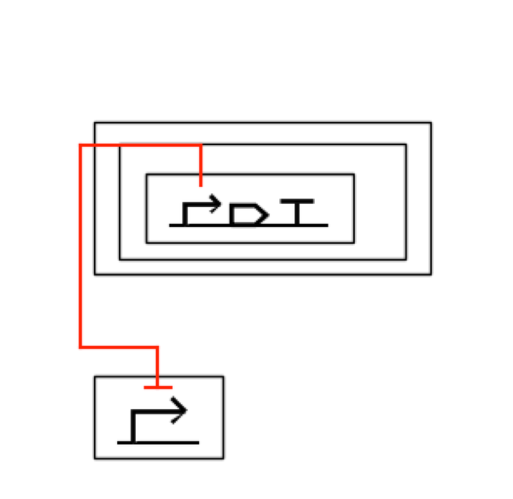
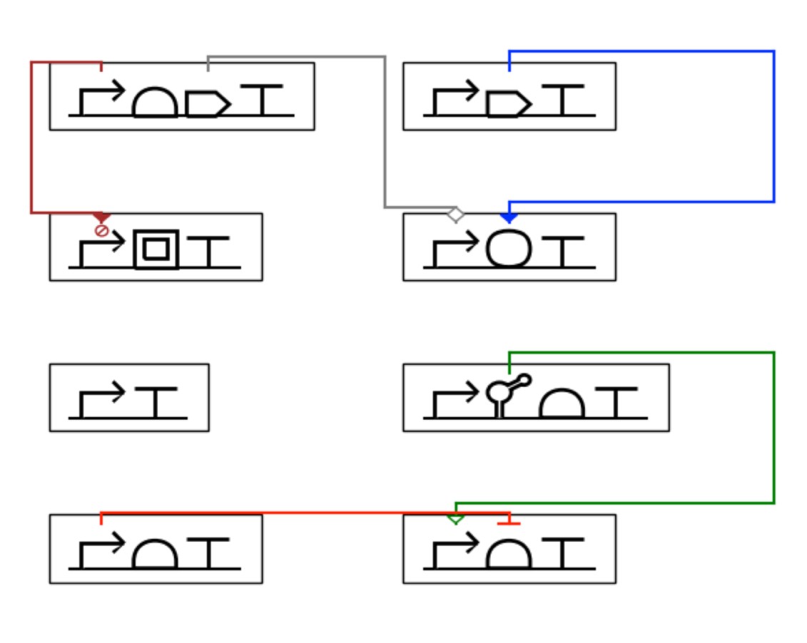
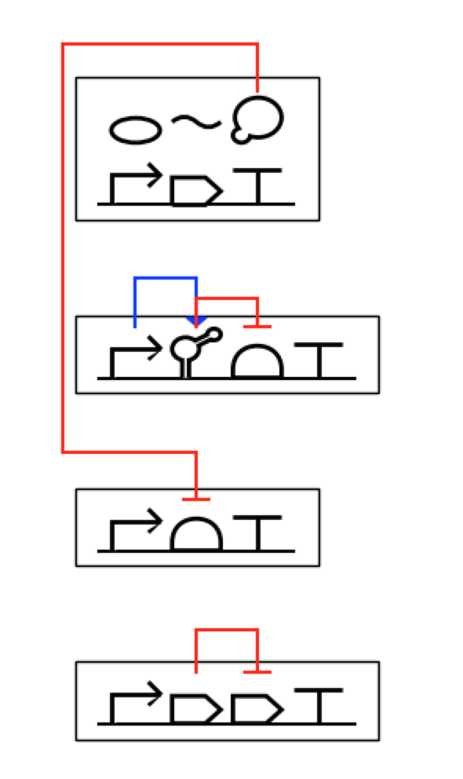

# DNAplotlib supporting pySBOL2 

DNAplotlib is a library that enables highly customizable visualization of individual genetic constructs and libraries of design variants. The original repository is developed under Voight Lab in the following link: 
<a href="https://github.com/VoigtLab/dnaplotlib">Der B.S., Glassey E., Bartley B.A., Enghuus C., Goodman D.B., Gordon D.B., Voigt C.A., Gorochowski T.E., "DNAplotlib: programmable visualization of genetic designs and associated data", ACS Synthetic Biology, 2016. (DOI: 10.1021/acssynbio.6b00252)</a>

This folked repository is updated by Sunwoo Kang as a part of Google's Summer of Code 2018 project. Her work was guided by mentors Thomas Gorochowski and Bryan Bartley. The updates are mainly: 

1. making DNAplotlib compatible with <a href=http://sbolstandard.org/visual/glyphs/>SBOL Visual Standard 2</a>
2. Rendering of non-DNA components
3. Defining modules and interactions between them
4. Visualizing submodules within modules 
5. Importing/exporting design data from SBOL files

## List of Commits
Commit period: May 16, 2018 - Now
* <a href=https://github.com/swkang73/dnaplotlib/commits/master> ac58dd3 </a>: setup for rendering sbol files
* <a href=https://github.com/swkang73/dnaplotlib/commits/master> e38ccd1 </a>: sanity check for componentDefinition & targer promoter file
* <a href=https://github.com/swkang73/dnaplotlib/commits/master> 605bbfa </a>: pysbol not available in ijupyter
* <a href=https://github.com/swkang73/dnaplotlib/commits/master> 1e2836d </a> nonsense sbol compliant files 
* <a href=https://github.com/swkang73/dnaplotlib/commits/master> 5d7f395 </a> three level hierarchy file
* <a href=https://github.com/swkang73/dnaplotlib/commits/master> 21a8d57 </a> script for specifying primary structure of all component definitions
* <a href=https://github.com/swkang73/dnaplotlib/commits/master> 4be3f05 </a> cleanup nonsense primary structure script
* <a href=https://github.com/swkang73/dnaplotlib/commits/master> b571ccc </a> fetch components in order of primary structure & render glyphs 
* <a href=https://github.com/swkang73/dnaplotlib/commits/master> 87cbd8f </a> draw glyph function from render.py is now drawn on position
* <a href=https://github.com/swkang73/dnaplotlib/commits/master> 1fc6b4b </a> sbol2plotlib plays with matplotlib drawing 
* <a href=https://github.com/swkang73/dnaplotlib/commits/master> 69c34f8 </a> glyph resized to given frame
* <a href=https://github.com/swkang73/dnaplotlib/commits/master> 6e29311 </a> promoter svg file updated, bug found with glyph render func
* <a href=https://github.com/swkang73/dnaplotlib/commits/master> 1175460 </a> finished promoter svg file cleanup & started ori cleanup 
* <a href=https://github.com/swkang73/dnaplotlib/commits/master> c70c803 </a> strandrenderer added (draw dna backbone)
* <a href=https://github.com/swkang73/dnaplotlib/commits/master> 53b9217 </a> sanity file & rotate fuc 
* <a href=https://github.com/swkang73/dnaplotlib/commits/master> e06b23d </a> example added & rotation func 
* <a href=https://github.com/swkang73/dnaplotlib/commits/master> dd26852, 970bae2 </a> struggle commiting to original repo
* <a href=https://github.com/swkang73/dnaplotlib/commits/master> b6ac1db </a> ori svg file & draw_glyph can render circle
* <a href=https://github.com/swkang73/dnaplotlib/commits/master> cc9b26d </a> python syntax 
* <a href=https://github.com/swkang73/dnaplotlib/commits/master> b6bd28e </a> hierarchy module box rendering func
* <a href=https://github.com/swkang73/dnaplotlib/commits/master> 6ae7137 </a> macromolecule svg attempt
* <a href=https://github.com/swkang73/dnaplotlib/commits/master> a302260 </a> unspecified svg & cds attempt 
* <a href=https://github.com/swkang73/dnaplotlib/commits/master> 9499f68 </a> glyph rendering y correction func added 
* <a href=https://github.com/swkang73/dnaplotlib/commits/master> f2c6769 </a> datatype test case first created 
* <a href=https://github.com/swkang73/dnaplotlib/commits/master> 7ee4415 </a> positioning func for design & modules
* <a href=https://github.com/swkang73/dnaplotlib/commits/master> 12ba693 </a> bug fix for module positioning 
* <a href=https://github.com/swkang73/dnaplotlib/commits/master> 64aaf63 </a> origin coordinate tuple changed to list
* <a href=https://github.com/swkang73/dnaplotlib/commits/master> c0997fc </a> promoter frame bug fix
* <a href=https://github.com/swkang73/dnaplotlib/commits/master> 0a576b9 </a> interaction arrow body rendering func 
* <a href=https://github.com/swkang73/dnaplotlib/commits/master> 10b13a2 </a> arrowhead for interaction added 
* <a href=https://github.com/swkang73/dnaplotlib/commits/master> dfdc00b </a> finished recursive rendering of modules 
* <a href=https://github.com/swkang73/dnaplotlib/commits/master> 7429ad9 </a> coordinate property added to datatype interaction class
* <a href=https://github.com/swkang73/dnaplotlib/commits/master> 3bd80f4 </a> Interaction Render class 
* <a href=https://github.com/swkang73/dnaplotlib/commits/master> 44e5871 </a> other part RNA rendering 
* <a href=https://github.com/swkang73/dnaplotlib/commits/master> ff71af6 </a> save before submodule render fix
* <a href=https://github.com/swkang73/dnaplotlib/commits/master> 24dcba2 </a> submodule render spacing bug fix
* <a href=https://github.com/swkang73/dnaplotlib/commits/master> 99a9238 </a> run into bug while importing sbol file 
* <a href=https://github.com/swkang73/dnaplotlib/commits/master> fad5f32 </a> test_design5 import and export modules & components 
* <a href=https://github.com/swkang73/dnaplotlib/commits/master> 6deec09 </a> bug fix & func decomposition
* <a href=https://github.com/swkang73/dnaplotlib/commits/master> e7ec582, bbe6214, fe994fb, 8695653 </a> readme edit for final submission

## Visualization Example
Here are some example visualization by the updated DNAplotlib. 

### Non-DNA Components (RNA, protein, etc)

### Intermodular & Intramodular Interactions 

### Hierarchical Modules and Submodules 

More visualization example scripts can be found under the examples directory. 

## Installation
DNAplotlib is based on pySBOL2. Thus, the user need to first download the latest pySBOL package. The DNAplotlib library is contained within the `dnaplotlib.py` file in the `lib` directory and requires Python 2.6 and matplotlib 1.2 or newer. To install add the location of this file to your `PYTHONPATH` and you are good to: `import dnaplotlib`

## To Do 
- debug StopIteration Error during recursive reading of submodules 
- import/export csv files containing genetic circuit design data 
- read/save interaction into design data
- support user rendering customization (color, linewidth, etc)
