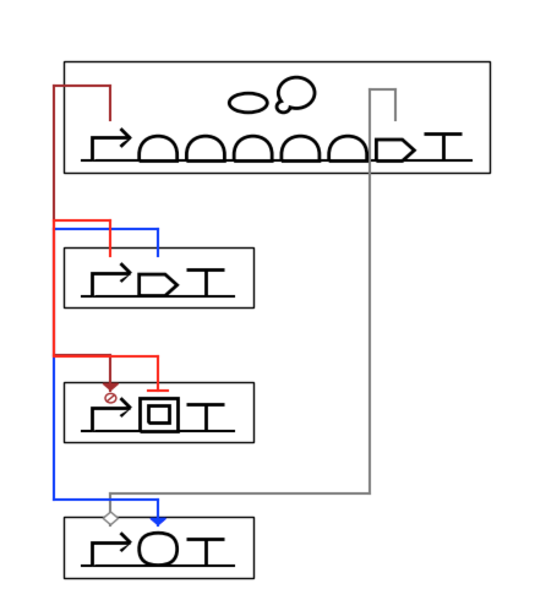
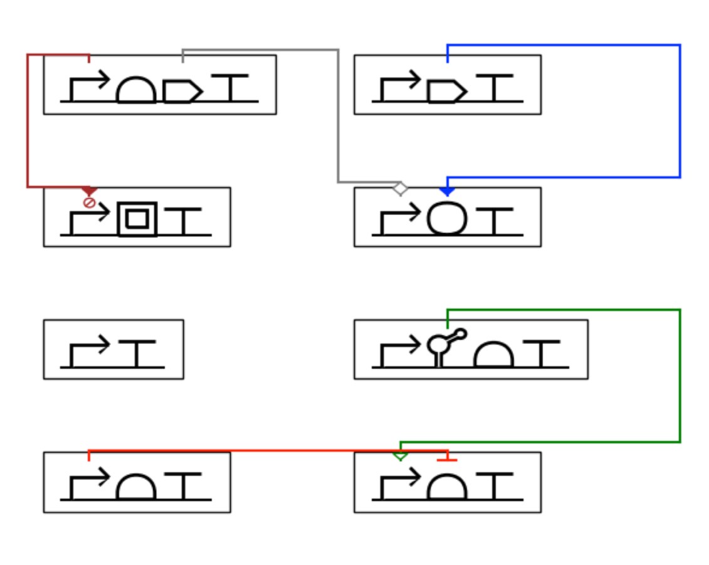
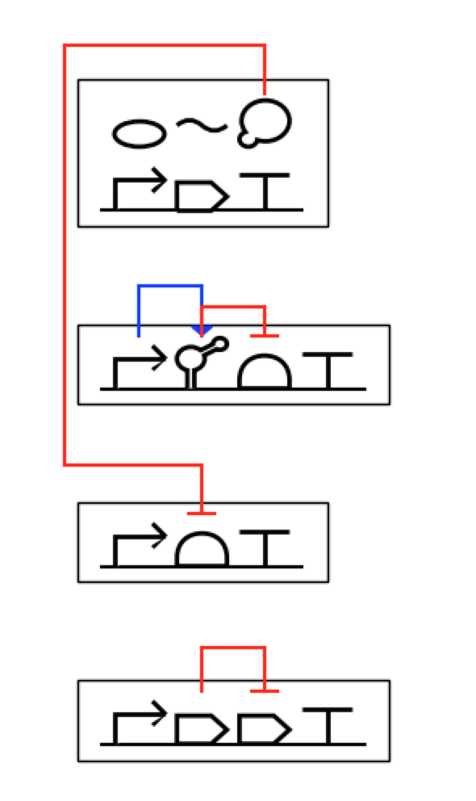
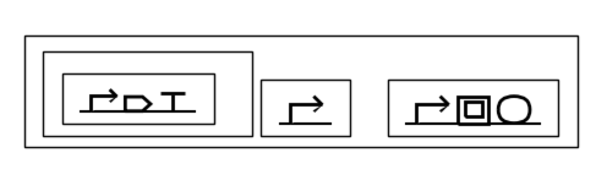
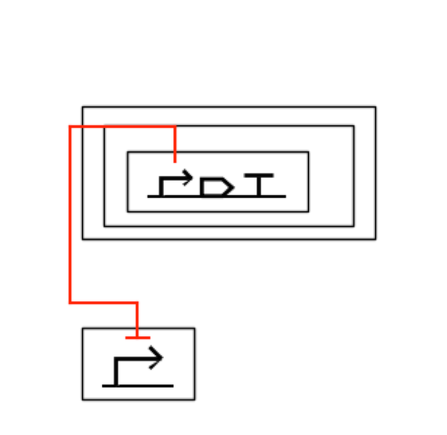

# DNAplotlib supporting pySBOL2 Visual and Data Model

DNAplotlib is a library that enables highly customizable visualization of individual genetic constructs and libraries of design variants. 

This forked repository is updated by Sunwoo Kang as a part of Google's Summer of Code 2018 project. The updated visualization follows the latest standard of <a href="http://sbolstandard.org"> Synthetic Biology Open Language (SBOL) version 2.2 </a>. This library allows both import/export, and creation of SBOL2 files. The original repository was developed under Voigt Lab in the following link: 

<a href="https://github.com/VoigtLab/dnaplotlib">Der B.S., Glassey E., Bartley B.A., Enghuus C., Goodman D.B., Gordon D.B., Voigt C.A., Gorochowski T.E., "DNAplotlib: programmable visualization of genetic designs and associated data", ACS Synthetic Biology, 2016. (DOI: 10.1021/acssynbio.6b00252)</a> 

## Updates
My [Sunwoo Kang’s] task was to help the main developer of DNAplotlib, Tom Gorochowski, provide ways to render SVG files on Matplotlib canvas (svgpath2mpl.py), and develop a new datatype to store the genetic circuit design data (datatype.py) that is compatible with SBOL standard. The previous DNAplotlib rendered each part by raw coordinates, but with the updated version having more part glyphs we decided to standardize parts by having different parts saved as svg files, then using same drawing function to render them. 

To develop these features, I helped Tom producing parametric SVG files of SBOL Visual glyph. There are nine clean SVG files, which includes a few new glyphs from the SBOL Visual 2 such as macromolecules and RNA strand. Since the svg files provided on the website were created by software, they came with properties that was hard to extract path values. For the sake of time, I moved on to the next step of the project. I created rendering function (render.py) to render these glyphs at a user-specified position or automatically position the genetic circuit design in the canvas. The main challenge was coming up with the best default rendering convention. This included aspects such as altering the datatype to accommodate the overall extent of a glyph and specifying the position of the origin in each glyph to be lower left corner of the SVG image. The functions automatically position and align parts on a DNA strand. In addition user can adjust size, positioning, and angle of the visual glyphs.

I also wrote functions that would automatically position and draw parts not associated to a DNA strand (e.g. a protein), modules, submodules, and interactions. This involved writing recursive functions to fully visualize complex hierarchies and the interactions between components at various levels. Furthermore, I abstracted the interaction rendering in a way that allows easier differentiation of interactions by their arrowhead and colors. To avoid multiple interactions causing confusion, I added random positioning to arrow path heights so that no two or more arrows have the height values. 

The final step of the project was to import and export the design data into SBOL files. DNAplotlib now allows import/export and rendering of simple genetic design consisted of parts and modules. It also supports the creation and rendering of complex genetic design with modular hierarchies and interactions. The example test design files can be found under dnaplotlib/design directory. However, when writing this code, I ran into backend problems with the pySBOL library, such as StopIteration errors, which I was unable to debug in the time I had available. However, I did have some success importing and exporting simple genetic circuit designs (see ie.py). 

## Visualization Example
Here are some example visualization by the updated DNAplotlib. 

### Non-DNA Components (RNA, protein, etc)

### Intermodular & Intramodular Interactions 

### Hierarchical Modules and Submodules 

More visualization example scripts can be found under the dnaplotlib/examples directory. 

## Code example 

### import sbol file
	doc = sbol.Document()
	doc.read('test_design.xml')

### create visualization design from doc 
	design = dt.Design('design')
	design.add_module(extract_module_and_components(doc, design, doc.moduleDefinitions))
	design.print_design() # optional - check whether design properly imported 
	m_frames = draw.get_module_frames(design.modules) 

### draw design
	fig, ax = plt.subplots(1, figsize=(8,10))
	ax.set_xlim(XMIN, XMAX)
	ax.set_ylim(YMIN, YMAX)
	ax.set_axis_off()
	draw.draw_all_modules(ax, m_frames, design.modules)
	draw_all_interaction(ax, design.interactions)
	plt.show()

### export sbol file
	document = sbol.Document()	
	document.addNamespace('http://dnaplotlib.org#', 'dnaplotlib')
	datatype.save_design_into_doc(document, design)
	document.write('test_design_updated.xml')

## List of Commits
Commit period: May 16, 2018 - Now
* <a href=https://github.com/swkang73/dnaplotlib/commits/master> ac58dd3 </a>: setup for rendering sbol files
* <a href=https://github.com/swkang73/dnaplotlib/commits/master> e38ccd1 </a>: sanity check for componentDefinition & targer promoter file
* <a href=https://github.com/swkang73/dnaplotlib/commits/master> 605bbfa </a>: pysbol not available in ijupyter
* <a href=https://github.com/swkang73/dnaplotlib/commits/master> 1e2836d </a>: nonsense sbol compliant files 
* <a href=https://github.com/swkang73/dnaplotlib/commits/master> 5d7f395 </a>: three level hierarchy file
* <a href=https://github.com/swkang73/dnaplotlib/commits/master> 21a8d57 </a>: script for specifying primary structure of all component definitions
* <a href=https://github.com/swkang73/dnaplotlib/commits/master> 4be3f05 </a>: cleanup nonsense primary structure script
* <a href=https://github.com/swkang73/dnaplotlib/commits/master> b571ccc </a>: fetch components in order of primary structure & render glyphs 
* <a href=https://github.com/swkang73/dnaplotlib/commits/master> 87cbd8f </a>: draw glyph function from render.py is now drawn on position
* <a href=https://github.com/swkang73/dnaplotlib/commits/master> 1fc6b4b </a>: sbol2plotlib plays with matplotlib drawing 
* <a href=https://github.com/swkang73/dnaplotlib/commits/master> 69c34f8 </a>: glyph resized to given frame
* <a href=https://github.com/swkang73/dnaplotlib/commits/master> 6e29311 </a>: promoter svg file updated, bug found with glyph render func
* <a href=https://github.com/swkang73/dnaplotlib/commits/master> 1175460 </a>: finished promoter svg file cleanup & started ori cleanup 
* <a href=https://github.com/swkang73/dnaplotlib/commits/master> c70c803 </a>: strandrenderer added (draw dna backbone)
* <a href=https://github.com/swkang73/dnaplotlib/commits/master> 53b9217 </a>: sanity file & rotate fuc 
* <a href=https://github.com/swkang73/dnaplotlib/commits/master> e06b23d </a>: example added & rotation func 
* <a href=https://github.com/swkang73/dnaplotlib/commits/master> dd26852, 970bae2 </a>: struggle commiting to original repo
* <a href=https://github.com/swkang73/dnaplotlib/commits/master> b6ac1db </a>: ori svg file & draw_glyph can render circle
* <a href=https://github.com/swkang73/dnaplotlib/commits/master> cc9b26d </a>: python syntax 
* <a href=https://github.com/swkang73/dnaplotlib/commits/master> b6bd28e </a>: hierarchy module box rendering func
* <a href=https://github.com/swkang73/dnaplotlib/commits/master> 6ae7137 </a>: macromolecule svg attempt
* <a href=https://github.com/swkang73/dnaplotlib/commits/master> a302260 </a>: unspecified svg & cds attempt 
* <a href=https://github.com/swkang73/dnaplotlib/commits/master> 9499f68 </a>: glyph rendering y correction func added 
* <a href=https://github.com/swkang73/dnaplotlib/commits/master> f2c6769 </a>: datatype test case first created 
* <a href=https://github.com/swkang73/dnaplotlib/commits/master> 7ee4415 </a>: positioning func for design & modules
* <a href=https://github.com/swkang73/dnaplotlib/commits/master> 12ba693 </a>: bug fix for module positioning 
* <a href=https://github.com/swkang73/dnaplotlib/commits/master> 64aaf63 </a>: origin coordinate tuple changed to list
* <a href=https://github.com/swkang73/dnaplotlib/commits/master> c0997fc </a>: promoter frame bug fix
* <a href=https://github.com/swkang73/dnaplotlib/commits/master> 0a576b9 </a>: interaction arrow body rendering func 
* <a href=https://github.com/swkang73/dnaplotlib/commits/master> 10b13a2 </a>: arrowhead for interaction added 
* <a href=https://github.com/swkang73/dnaplotlib/commits/master> dfdc00b </a>: finished recursive rendering of modules 
* <a href=https://github.com/swkang73/dnaplotlib/commits/master> 7429ad9 </a>: coordinate property added to datatype interaction class
* <a href=https://github.com/swkang73/dnaplotlib/commits/master> 3bd80f4 </a>: Interaction Render class 
* <a href=https://github.com/swkang73/dnaplotlib/commits/master> 44e5871 </a>: other part RNA rendering 
* <a href=https://github.com/swkang73/dnaplotlib/commits/master> ff71af6 </a>: save before submodule render fix
* <a href=https://github.com/swkang73/dnaplotlib/commits/master> 24dcba2 </a>: submodule render spacing bug fix
* <a href=https://github.com/swkang73/dnaplotlib/commits/master> 99a9238 </a>: run into bug while importing sbol file 
* <a href=https://github.com/swkang73/dnaplotlib/commits/master> fad5f32 </a>: test_design5 import and export modules & components 
* <a href=https://github.com/swkang73/dnaplotlib/commits/master> 6deec09 </a>: bug fix & func decomposition
* <a href=https://github.com/swkang73/dnaplotlib/commits/master> e7ec582, bbe6214, fe994fb, 8695653, f821381, 419d435, 4adf901 </a>: readme edit for final submission

## Installation
The DNAplotlib library is contained within the `dnaplotlib.py` file in the `lib` directory and requires Python 2.6 and matplotlib 1.2 or newer and pySBOL package. To install follow instructions below and: `import dnaplotlib`

Get setuptools if you don't have it:
https://pypi.org/project/setuptools/2.0/#installation-instructions

Install the Dnaplotlib package on your system in a contained development environment:
python setup.py develop --user

You should now be able to import Dnaplotlib from any directory on your system and import it into other projects. Edits to source code in your development repository will be reflected in the behavior of the package without reinstalling it.

To clean the development package from your system:
python setup.py develop --user --uninstall

<a href="https://stackoverflow.com/questions/27630114/matplotlib-issue-on-os-x-importerror-cannot-import-name-thread"> Note some issue importing matplotlib dependency on Mac OS X Yosemite and later </a>

## To Do 
DNAplotlib would be useful if it can also handle simple CSV files with genetic design definitions.  Also it should allow more visualization options (e.g. customization of basic visual properties like color) and save back the visual properties generated by my functions to SBOL files as an extension. Finally, the 
StopIteration Error during recursive reading of submodules need debugging.

## Acknowledgement
I would like to thank my mentors, Thomas Gorochowski, PhD (University of Bristol) and Bryan Bartley, PhD (Raytheon BBN Technologies), for their guidance and support. I would further like thank NRNB and SBOL community for their warm welcome, and National Science Foundation for generous support to attend the COMBINE 2018 conference. Lastly, I express my gratitude to Google for hosting Code for Summer program. 
