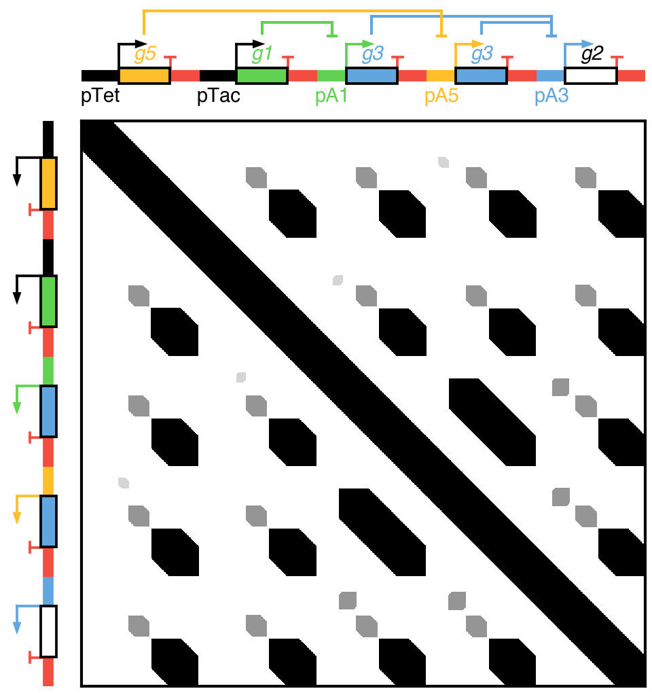

#Rotated Design

Illustration of how to draw rotated designs. Here the example uses this functionality to construct a homology matrix for a CRISPRi genetic logic circuit. Black areas are 60bp homology, dark grey areas are 30bp homology and light grey areas are 15bp homology. It is clear to see the reuse of terminators in the design and shared portions of gRNAs.
